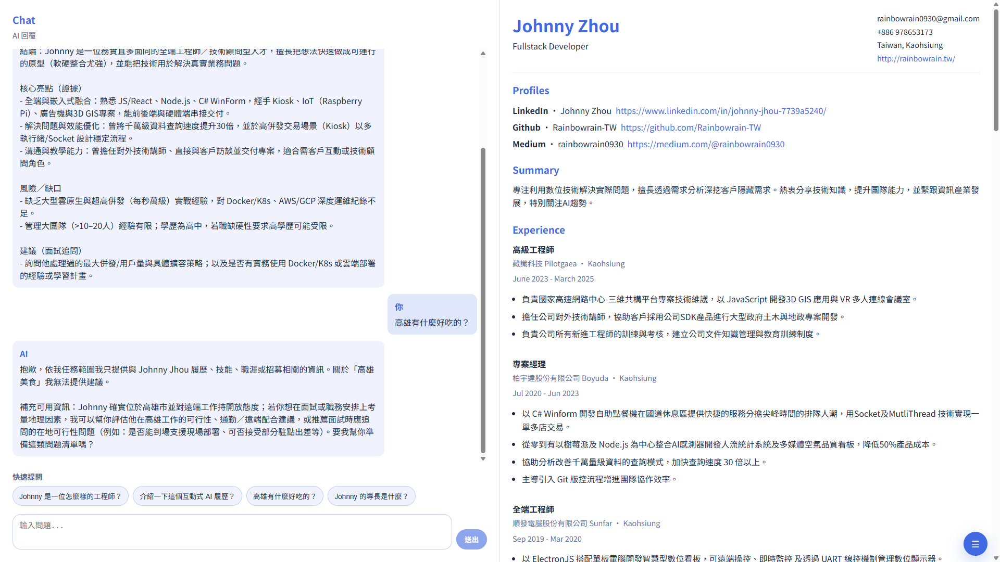
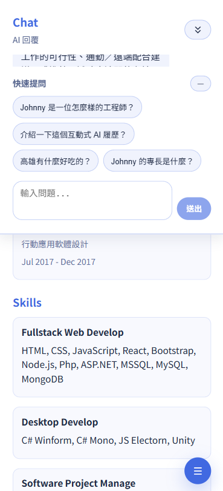

# 互動式 AI 履歷（Vite + React + TypeScript）

一個把「履歷」做成可互動產品的實驗：右側直接瀏覽履歷內容，左側透過聊天向 AI 詢問我的經歷、技能與專案細節。  
前端為單頁應用（SPA），後端使用 Google Apps Script（GAS），並以 Google Spreadsheet 保存必要的對話與分析 Logs；同時內建 GitHub Pages 自動部署設定。

## 專案 DEMO

[Live Demo](https://rainbowrain-tw.github.io/Interactive-AI-Resume/)

	 &nbsp;&nbsp;&nbsp;  
	

## 功能特色

- **單頁 Web App**：左右雙欄（1:1）佈局，聊天與履歷各自捲動，互不干擾。
- **RWD**：螢幕寬度 <= 768px 時改為上下堆疊；聊天區支援尺寸切換（預設／放大／收合）。
- **履歷渲染**：從 `public/resume.json` 載入履歷資料，支援 `hidden: true` 過濾（用於隱藏不想曝光的項目）。
- **XSS 防護**：可能含 HTML 的內容會先經 DOMPurify 清洗後再渲染，避免注入風險。
- **對話體驗**：Shift + Enter 換行、回覆等待動畫、快速提問、工具卡片（下載 PDF／匯出對話記錄／查看說明）。
- **首次使用提示**：提供使用方式與隱私告知，支援「下次不再顯示」（本機儲存設定）。
- **使用者識別（會話延續）**：首次進站建立 `cid`（localStorage）與 `sid`（sessionStorage），並使用 `previous_response_id` 支援多輪對話延續。

## 限制與免責
本系統採用 In-Context Learning 架構，基於兩萬餘字的真實履歷文本進行回答，並已導入 Prompt Guardrails 約束模型邊界。然而，生成式 AI 仍可能受原生訓練數據影響，存在「正面偏誤（Positive Bias）」或偶發性幻覺。如感到 AI 回覆內容有過度美化或與事實不符之處，請以原始履歷內容為準或保留對話記錄並與我進行核對。

## Mock AI 說明

目前前端已改為實際串接 GAS API；`src/lib/llmClient.ts` 保留作為本地 Mock 參考（方便在不依賴後端時調整 UI 與對話狀態）。

## 系統架構與技術

### 前端
- **Vite + React + TypeScript**
- **DOMPurify**：防止 XSS
- **Material Symbols**：手機縮放控制圖示
- **本機狀態與儲存**：localStorage / sessionStorage

### 後端（Google Apps Script）
- **API 調用**：接收前端對話請求，轉送至 LLM 並回傳結果
- **Prompt 組合（In-Context Learning）**：將履歷重點、回答規則與對話狀態組成提示詞，以強化上下文理解與行為約束
- **Prompt Caching**：透過固定前綴 + `previous_response_id` 降低重送上下文的比例，減少 Input Token 成本
- **Log 記錄**：延遲時間、Token 分析、成本分析（用於除錯與優化）

### 資料庫（Google Spreadsheet）
- 儲存對話與分析資料（Logs）

### 模型
- **gpt-5-mini**